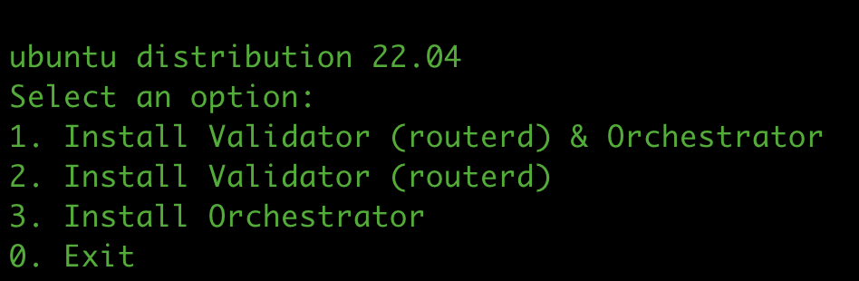
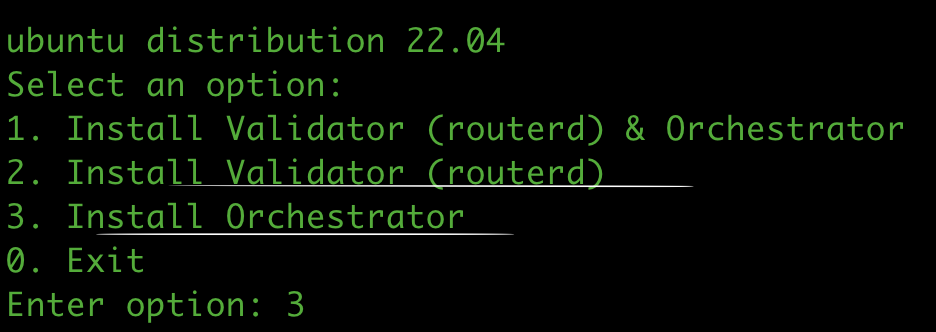
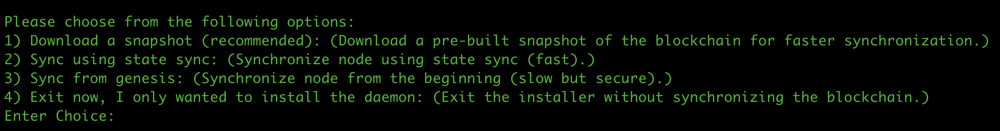

# Mainnet Setup

## Create config.json

Create config.json file using the following command:

```shell
vim config.json
```

and paste the following content in the config.json file:

```json
{
    "snapshot_url": "",
    "seed_peers": "",
    "genesis": "",
    "genesis_checksum": "",
    "snap_rpc_url": ""
}
```

## Setup validator

```shell
curl -L https://bit.ly/48BNjm4 > rv.sh && bash rv.sh config.json
```

### Setup using validator onboarding script

1. Select option 1 to install both node and orchestrator
   
2. Or select option 2 or 3 to install only node or orchestrator respectively
   
3. State sync using one of the following options.
   1. Snapshot
   2. Fast sync
   3. Full node
   

   **Note:** Prefer to sync using snapshot (option 1) as it is reliable.
4. Start node

   start:   `sudo systemctl restart cosmovisor.service`

   check logs: `journalctl -u cosmovisor -f`
5. Start orchestrator

   start: `sudo systemctl restart orchestrator.service`

   check logs: `journalctl -u orchestrator -f`
